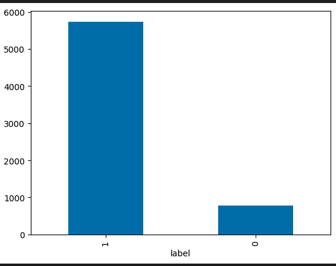
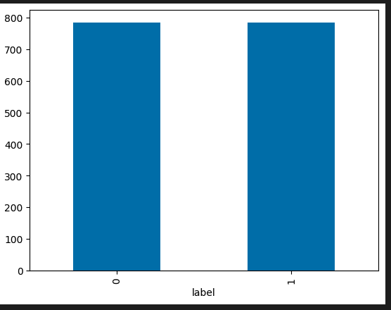

# Face_classification
This is a binary classification  task for human faces. We train a _mobilenet_v2_ model. Configuration the 

# Data Analysis

We have an unbanced class problem. Here is the distribution of classes:

When training a model on that data we reach a 100% accuracy for class 1 and a 0% accuracy on class 0.
We therefore drop samples from class1 to balced the distribution : 

And the metrics we now obtain are : 

'Class Accuracy': [0.9389, 0.9272],  
'Class Precision': [0.9282, 0.9380],  
'Class Recall': [0.9389, 0.9272],  
'Global Accuracy': 0.9330,  
'Global Precision': 0.9330,  
'Global Recall': 0.9330, 
